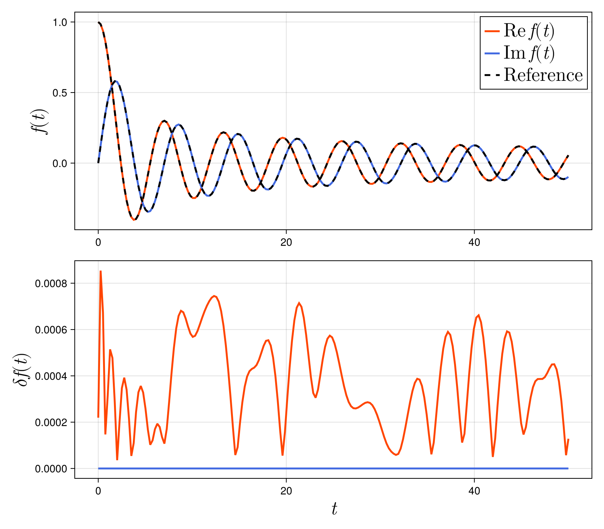

# Exponential Fitting

## `Exponentials` type

First, we introduce [`ExpFit.Exponentials`](@ref) type.  This type contains two fields: Exponents and coefficients of a sum of exponentials.  Let us show you how to use it.

We define an instance using `exponent` and `coefficient`.
```julia
exponent = [1.0 + 2.0im, 3.0 + 4.0im]
coefficient = [5.0 + 6.0im, 7.0 + 8.0im]
ef = Exponentials(exponent, coefficient)
```
The instance `ef` contains the exponents and coefficients.
```julia
julia> ef.expon
2-element Vector{ComplexF64}:
 1.0 + 2.0im
 3.0 + 4.0im
julia> ef.coeff
2-element Vector{ComplexF64}:
 5.0 + 6.0im
 7.0 + 8.0im
```
`ef` also has a method and can be used as a function that returns `sum(ef.coeff .* exp.(-ef.expon .* (t-t0)))`
```julia
julia> f = t -> ef(t)
#1 (generic function with 1 method)

julia> g = t -> ef(t, 1.0)
#3 (generic function with 1 method)
```

## `expfit`

As an example to demonstrate how to use the `expfit` function, consider approximating a Bessel function with a sum of exponentials. The following is the code. 

```julia
sing LinearAlgebra
using ExpFit
using SpecialFunctions

tmin = 0.0
tmax  = 50.0      
tol = 1e-3     
N = 100
f = t -> besselj(0,t) + 1.0im*besselj(1,t)
ef = expfit(f, tmin, tmax, N, tol)
print("Approximation order = ", length(ef.coeff), "\n")

t = range(tmin, tmax, length=N*2)
err = abs.(ef.(t) .- f.(t))
println("Root mean square = ", norm(err)/sqrt(N))
```
Here, tmin and tmax specify the range used for the approximation, N is the number of sample points, and tol is the tolerance.
`ef` is the instance of [`ExpFit.Exponentials`](@ref).

When executed, the terminal will display the following.
```
Approximation order = 6
Root mean square = 0.0005937677782521255
```
The Bessel function was approximated with six terms for the tolerance of $10^{-2}$.

The results are also illustrated below.


We observe that the absolute error $\delta f(t)$ is within the tolerance.

As an alternative use case, equally spaced discrete data can be input into the `expfit` function. Here, dt represents the time interval.
```julia
dt = (tmax-tmin) / (N-1)
fv = f.(t)
ef = expfit(fv, dt, tol)
```

Additionally, the approximation order can be set instead of the tolerance.
```julia
order = 10
ef = expfit(f, tmin, tmax, N, order)
ef = expfit(fv, dt, order)
```

## Algorithms

The default algorithm used in `expfit` is ESPRIT algorithm.  
If you want use a different algorithm, you can set the `alg` option  as
```julia
ef = expfit(fv, dt, tol; alg=ESPIRA1())
```
Available algorithms and corresponding options are shown below.
| Alogrithm | Option "alg" |
| --------  | ------------ |
| ESPRIT | ESPRIT()    |
| Matrix Pencil | Pencil() |
| Prony    | Prony()    |
| ESPIRA-I | ESPIRA1() |
| ESPIRA-II | ESPIRA2() |
| Fast ESPRIT | FastESPRIT() |


Please see [Reference](@ref) for all the available methods.