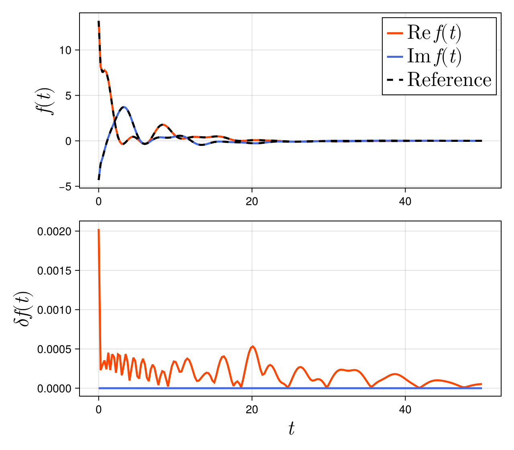

# Exponential Model Reduction 

## `expred`

When an exponential sum 
```math
f(t) = \sum_{i=1}^N c_i \mathrm{e}^{-a_i t}, \quad \mathrm{Re}\;a_i > 0
```
is already available, the `expred` function can find a reduced exponential sum approximation with fewer terms for a given tolerance i.e.
```math
\left\|f(t)-\sum_{i=1}^{N'} c_i' \mathrm{e}^{-a_i' t}\right\|<\epsilon, \quad \mathrm{Re}\;a_i' > 0
```
where ``N'<N``.

Let `a` be the vector storing the initial exponents and `c` be the vector storing the initial coefficients. Here, we consider a sum of 100 terms, which are generated randomly. Note that the real part of `a` must be non-negative.
```julia
er = expred(a, c, 1e-2)
print("Approximation order = ", length(er.coeff), "\n")

t = range(0.0, 50.0, length=100)
err = abs.(er.(t) .- Exponentials(a,c).(t))
println("Root mean square = ", norm(err)/sqrt(N))
```
`er` is an instance of the `Exponentials` type.

When executed, the terminal will display the following.
```
Approximation order = 10
Root mean square = 0.0003602011932219654
```

The results are also illustrated below.


